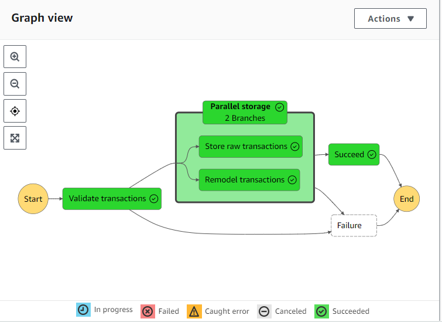
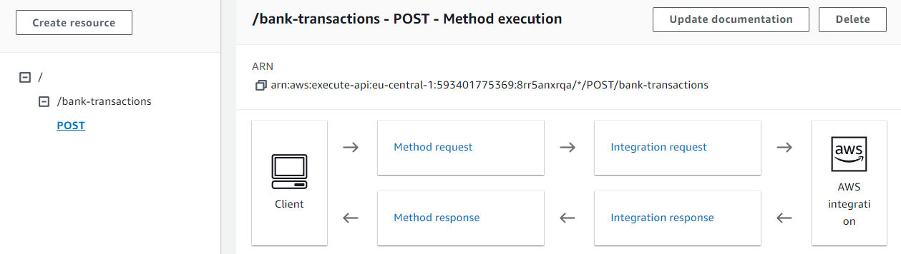
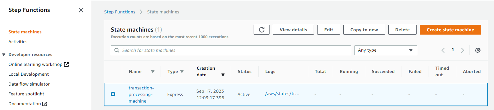

# Welcome to serverless webhook pipeline project

This is a sample project, implementing a webhook, receiving sample bank transactions data
, which we validate, format and store as part of a data pipeline.

This pipeline is realized using AWS services, such as API Gateway, Lambda, DynamoDB, S3, and StepFunctions.
Using the AWS CDK, we can deploy the infrastructure as code, and also run unit tests.

The whole data pipeline runs as a state machine, which is triggered by an API Gateway webhook.
The different states validate, format and store the data in DynamoDB and S3.

## License

This project is licensed under the MIT License - see the [LICENSE](LICENSE) file for details.

### DynamoDB Format

The remodelled transaction data in DynamoDb will be stored in format like the following(the table below is incomplete):

| PK                      | SK                                          | amount | bankAccountId | bankName |
|-------------------------|---------------------------------------------|--------|---------------|----------|
| IBAN#NL01INHO0000000001 | TRANSACTION#tr_123#2023-09-23T08:30:36.550Z | 100.00 | account_XXX   | ING      |
| IBAN#NL01INHO0000000001 | TRANSACTION#tr_124#2023-09-23T08:30:36.550Z | 200.00 | account_XXX   | ING      |
| IBAN#NL01INHO0000000001 | TRANSACTION#tr_125#2023-09-23T08:30:36.550Z | 300.00 | account_XXX   | ING      |

Schema
------

AWS Console screenshots
------------

## To run the project and deploy resources:

* `npm install` to install dependencies
* `cdk bootstrap` to bootstrap the AWS CDK Toolkit into your AWS account
* `cdk deploy` to deploy the stack to your AWS account/region

## Useful commands for project

* `npm run watch`   watch for changes and compile
* `npm run test`    perform the jest unit tests
* `cdk deploy`      deploy this stack to your default AWS account/region
* `cdk diff`        compare deployed stack with current state
* `cdk synth`       emits the synthesized CloudFormation template
